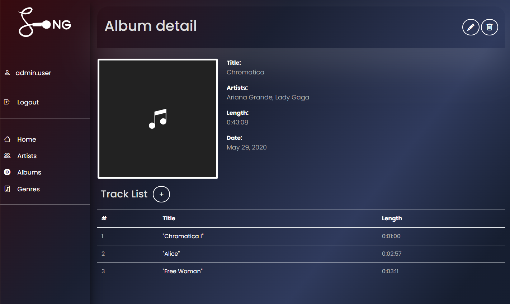

# Music Service
A Django project where an artist can create and modify music releases.

## You can check it via link below
[Music Service Project deployed to Render](https://music-service-2dkw.onrender.com/)

### Installation
Python3 must be installed
```shell
git clone https://github.com/shurushku/music.git
venv\Scripts\activate (on Windows)
source venv/bin/activate (on macOS)
pip install -r requirements.txt
---
python manage.py runserver
```
#### Login
For login you can use:
```shell
login: user
password: user12345
```

### Features
* You can login / logout.
* You can create and edit genres, albums, artists.
* You can search by album name, artist or genre.
* On the Album page, you can add songs.

## Demo

